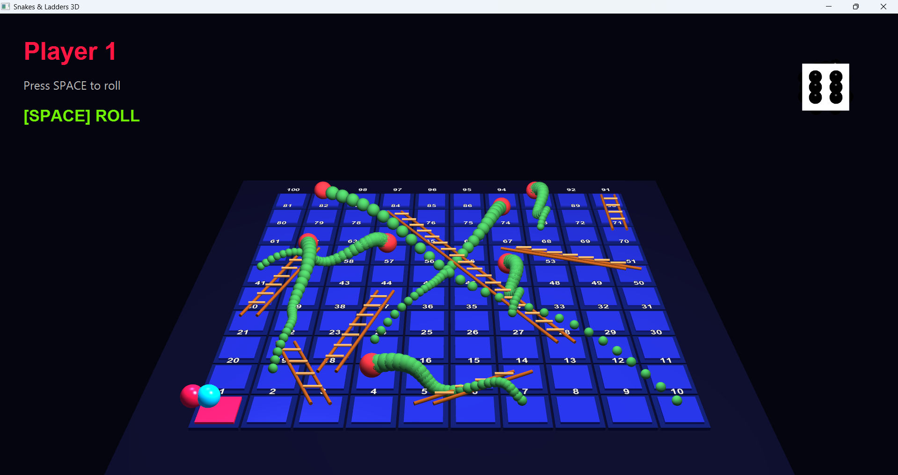
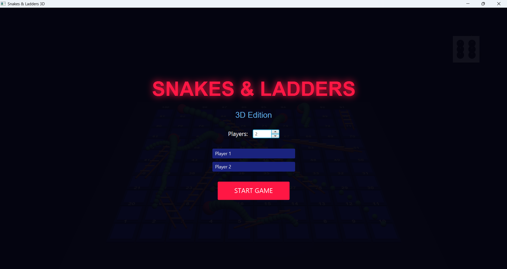
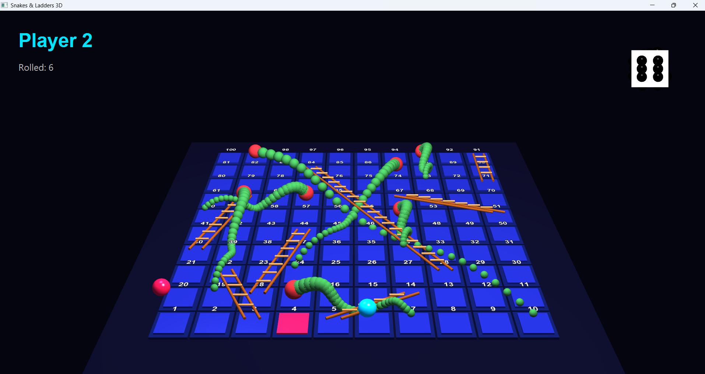
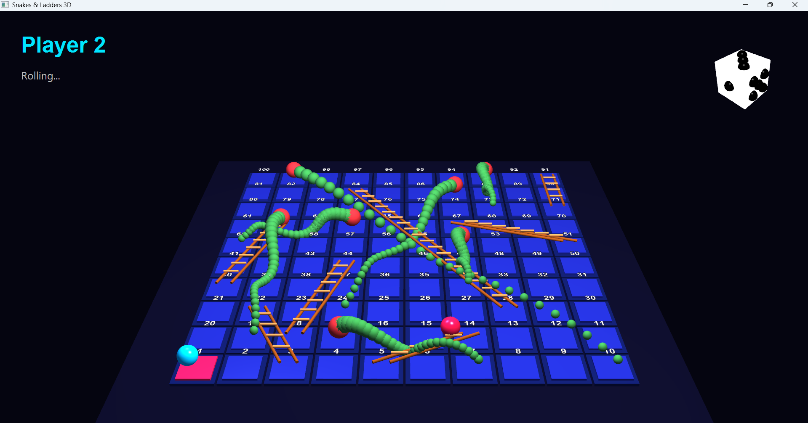

# 🎲 Snakes & Ladders 3D

A fully interactive 3D implementation of the classic board game **Snakes & Ladders**, built with **JavaFX** and featuring realistic 3D graphics, animations, and multiplayer support.



---

## 📋 Table of Contents

- [Features](#features)
- [Technologies](#technologies)
- [Architecture](#architecture)
- [Getting Started](#getting-started)
- [Game Mechanics](#game-mechanics)
- [Controls](#controls)
- [Class Documentation](#class-documentation)
- [Screenshots](#screenshots)
- [Future Enhancements](#future-enhancements)
- [Authors](#authors)

---

## ✨ Features

### Core Gameplay
- 🎮 **2-4 Player Multiplayer** — Play with friends on the same machine
- 🎲 **3D Animated Dice** — Realistic dice rolling with physics-based animations
- 🐍 **Snakes & Ladders** — Classic portal mechanics with visual 3D representations
- 🏆 **Win Detection** — First player to reach tile 100 wins

### 3D Visuals
- 🎨 **Neon-themed Board** — Glowing tiles with active player highlighting
- 🐍 **Realistic Snakes** — Animated 3D snake models with curved bodies
- 🪜 **3D Ladders** — Wooden ladder models with rails and rungs
- 🎲 **Detailed Dice** — White cube with black spherical dots on all faces
- 💡 **Dynamic Lighting** — Multiple light sources for realistic shading

### Animations
- ⭐ **Player Jump Movement** — Hopping animation between tiles
- 🛝 **Slide Animation** — Smooth sliding for snake/ladder transitions
- 🎲 **Dice Roll Animation** — Multi-axis spinning with snap-to-result
- ✨ **Blinking UI** — Pulsing text prompts for player turns

---

## 🛠 Technologies

| Technology | Version | Purpose |
|-----------|---------|---------|
| Java | 25+     | Core programming language |
| JavaFX | 19+     | 3D graphics and UI framework |
| Maven/Gradle | Latest  | Build automation |

### JavaFX Modules Used
- `javafx.controls` — UI controls (Buttons, Labels, Spinners)
- `javafx.graphics` — 3D shapes, cameras, lighting
- `javafx.animation` — Timeline, TranslateTransition, FadeTransition

---

## 🏗 Architecture

```
com.bitbywaleed/
├── App.java              # Main application entry point
├── BoardTile.java        # Individual board tile (3D)
├── Dice3D.java           # 3D dice with dot faces
├── Player.java           # Player pawn and movement logic
└── SnakeLadder.java      # Snake and ladder 3D models
```

### Design Patterns
- **MVC Architecture** — Model (game state), View (3D scene), Controller (input handling)
- **Observer Pattern** — JavaFX properties and event listeners
- **Factory Pattern** — Dynamic creation of tiles, snakes, and ladders

---

## 🚀 Getting Started

### Prerequisites
- Java JDK 25 or higher
- JavaFX SDK 19 or higher

### Installation

1. **Clone the repository**
   ```bash
   git clone https://github.com/MWM (Muhammad Waleed Memon) /snakes-ladders-3d.git
   cd snakes-ladders-3d
   ```

2. **Compile the project**
   ```bash
   javac --module-path /path/to/javafx/lib --add-modules javafx.controls,javafx.graphics com/bitbywaleed/*.java
   ```

3. **Run the game**
   ```bash
   java --module-path /path/to/javafx/lib --add-modules javafx.controls,javafx.graphics com.bitbywaleed.App
   ```

### Using an IDE (IntelliJ IDEA / Eclipse)
1. Create a new JavaFX project
2. Add the source files to `src/com/bitbywaleed/`
3. Configure VM options:
   ```
   --module-path /path/to/javafx/lib --add-modules javafx.controls,javafx.graphics
   ```
4. Run `App.java`

---

## 🎮 Game Mechanics

### Board Layout
- **10×10 Grid** — 100 tiles arranged in a zigzag pattern
- **Tile Numbering** — Starts at bottom-left (1), ends at top-left (100)
- **Alternating Rows** — Even rows left-to-right, odd rows right-to-left

### Snakes (Downward Portals)
| From | To | Visual |
|------|-----|--------|
| 17 | 7 | 🐍 Green snake with red head |
| 54 | 34 | 🐍 Green snake with red head |
| 62 | 19 | 🐍 Green snake with red head |
| 64 | 60 | 🐍 Green snake with red head |
| 87 | 24 | 🐍 Green snake with red head |
| 93 | 73 | 🐍 Green snake with red head |
| 99 | 10 | 🐍 Green snake with red head |

### Ladders (Upward Portals)
| From | To | Visual |
|------|-----|--------|
| 3 | 22 | 🪜 Brown wooden ladder |
| 5 | 14 | 🪜 Brown wooden ladder |
| 18 | 44 | 🪜 Brown wooden ladder |
| 28 | 84 | 🪜 Brown wooden ladder |
| 40 | 62 | 🪜 Brown wooden ladder |
| 51 | 67 | 🪜 Brown wooden ladder |
| 71 | 91 | 🪜 Brown wooden ladder |

### Rules
1. Players take turns rolling the dice
2. Move forward by the rolled number
3. Land on a ladder → climb up to the higher tile
4. Land on a snake → slide down to the lower tile
5. Must roll exact number to reach tile 100
6. First player to reach tile 100 wins

---

## 🕹 Controls

| Key / Action | Function |
|-------------|----------|
| `SPACE` | Roll the dice |
| `Mouse` | Navigate menus |
| `Close Window` | Exit game |

---

## 📚 Class Documentation

### `App.java`
Main application class extending `javafx.application.Application`.

**Key Methods:**
- `start(Stage stage)` — Initializes 3D scene, camera, lighting, and UI
- `createBoard()` — Generates 100 tiles in zigzag pattern
- `createLighting()` — Sets up ambient and point lights
- `roll()` — Handles dice roll and player movement
- `movePlayer(int roll)` — Calculates target tile and triggers animation

**Constants:**
```java
TILE_SIZE = 80          // Size of each board tile
BOARD_HALF = 400        // Half-width of the board
```

---

### `BoardTile.java`
Represents a single numbered tile on the board.

**Constructor:**
```java
public BoardTile(int id, double size)
```

**Methods:**
- `setActive(boolean active)` — Highlights tile in red when active player's turn
- `getTileNumber()` — Returns the tile number (1-100)

**Visual Components:**
- Dark blue base plate
- Glowing colored top layer
- White number text (rotated to lie flat)

---

### `Dice3D.java`
3D dice model with realistic dot faces.

**Constructor:**
```java
public Dice3D(double size)
```

**Methods:**
- `roll(int result, Runnable onFinished)` — Animates dice roll and snaps to result
- `showFace(int result)` — Rotates dice to show correct face (1-6)

**Face Mapping:**
| Result | rx | ry | Visible Face |
|--------|-----|-----|-------------|
| 1 | 0° | 0° | Front (1 dot) |
| 2 | 0° | -90° | Right (2 dots) |
| 3 | -90° | 0° | Top (3 dots) |
| 4 | 90° | 0° | Bottom (4 dots) |
| 5 | 0° | 90° | Left (5 dots) |
| 6 | 180° | 0° | Back (6 dots) |

---

### `Player.java`
Player pawn with movement animations.

**Constructor:**
```java
public Player(int id, String name, Color color)
```

**Methods:**
- `moveToTile(int targetTile, Map tileMap, Runnable onDone)` — Jump animation between tiles
- `slideToTile(int targetTile, Map tileMap, Runnable onDone)` — Slide animation for portals

**Properties:**
- `currentTile` — Current position (1-100)
- `color` — Player color (Red, Cyan, Lime, Yellow)

---

### `SnakeLadder.java`
3D models for snakes and ladders.

**Constructor:**
```java
public SnakeLadder(int start, int end, Point3D s, Point3D e)
```

**Ladder Features:**
- Two side rails (SaddleBrown)
- Multiple rungs (Peru)
- Automatically calculated based on distance

**Snake Features:**
- 30 spherical segments
- Red head, green body
- Sine wave body curve
- Animated wiggling movement

---

## 📸 Screenshots

### Main Menu

*Game start menu with player selection*

### Gameplay

*Active game with 3D board, snakes, and ladders*

### Dice Roll

*3D dice showing rolled result*

---

## 🔮 Future Enhancements

- [ ] **AI Opponents** — Play against computer-controlled players
- [ ] **Sound Effects** — Dice rolling, snake hissing, ladder climbing
- [ ] **Particle Effects** — Sparkles for ladder climbs, smoke for snakes
- [ ] **Save/Load Game** — Resume unfinished games
- [ ] **Custom Board Sizes** — 8×8, 12×12 grid options
- [ ] **Online Multiplayer** — Network play via sockets
- [ ] **Mobile Support** — Touch controls for Android/iOS

---

## 👨‍💻 Authors

- **Muhammad Waleed** — Developer & Designer

---

## 📄 License

This project is licensed under the MIT License.

---

## 🙏 Acknowledgments

- JavaFX Team for the 3D graphics framework
- Classic Snakes & Ladders game for the original concept

---

*Happy Gaming! 🎲🐍🪜*
